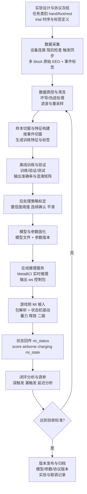

# Meta MI × MetaBCI 实施 SOP（可执行版）

本 SOP 用于把 MI 游戏闭环快速落地到可稳定运行状态，覆盖：采集、离线训练、在线部署、联调、验收、迭代。

## 流程框图（总览）

## 0. 目标与范围

目标：

- 在不改游戏核心代码的前提下，完成 MetaBCI 侧数据处理与在线控制对接。
- 实现 hand / foot / rest 三类控制稳定驱动游戏。
- 形成可复现实验记录与版本化发布流程。

范围：

- MetaBCI 侧：采集、训练、推理、发包。
- 游戏侧：接收 websocket 包并执行控制状态机。

参考交接协议：

- [META_MI_METABCI_HANDOFF.md](META_MI_METABCI_HANDOFF.md)

## 1. 角色分工（建议）

- 算法负责人：特征、模型、阈值策略、模型评估。
- 实验负责人：被试流程、采集质量、标注完整性。
- 工程负责人：在线推理服务、协议对接、日志与部署。
- 联调负责人：闭环测试、问题定位、回归验证。

## 2. D1-D7 推进计划

### D1：实验协议冻结

输入：

- 目标控制类：hand / foot / rest
- 采样率、导联方案、触发定义

动作：

- 冻结 trial 时序（提示、想象、休息、间隔）
- 冻结标签语义和命名规范
- 明确输出包字段（seq/timestamp/label/confidence）

产出：

- 实验协议 v1
- 标签字典 v1

验收：

- 团队对时序与标签无歧义

### D2：采集链路打通

动作：

- 完成设备连接、阻抗检查、触发同步
- 小样本采集 1-2 个 block
- 验证原始数据、事件标注、时间戳一致性

产出：

- 原始 EEG 示例数据
- 采集质量报告（坏导、掉包、漂移）

验收：

- 能稳定采集完整 block，标签与事件对齐

### D3：离线数据清洗与特征抽取

动作：

- 工频/带通处理
- 伪迹处理（必要时 ICA）
- 按事件切窗生成训练样本
- 形成统一特征输入格式

产出：

- clean 数据集
- 特征集（含标签）

验收：

- 每类样本数量达标且分布合理

### D4：离线模型训练与初评

动作：

- 训练基线模型（被试内优先）
- 交叉验证与测试
- 输出混淆矩阵与每类指标

产出：

- 模型权重 v1
- 离线评估报告 v1

验收：

- 核心类准确率达预设下限
- foot/rest 混淆可控

### D5：在线推理服务与协议对接

动作：

- 起 websocket 推理服务
- 实现实时推理 -> 协议包输出
- 对接游戏端 offline/online 入口

产出：

- 在线推理服务 v1
- 协议连通日志

验收：

- 游戏能稳定接收并解析包
- 可完成基础 hand/foot/rest 驱动

### D6：闭环联调与阈值标定

动作：

- 使用 mi_status 回传做策略门控
- 调整阈值、平滑与确认次数
- 记录误触发/漏触发场景

产出：

- 在线参数配置 v1
- 联调问题清单与修复记录

验收：

- 连续 10 分钟稳定运行
- 误触发显著下降

### D7：验收回归与发布

动作：

- 全流程回归（采集->训练->推理->游戏）
- 固化版本（模型、阈值、协议）
- 归档文档与实验日志

产出：

- 发布包 v1
- 验收报告 v1

验收：

- 通过第 7 节验收清单全部项

## 3. 数据采集 SOP（单次会话）

1. 设备准备：电极连接、阻抗检查、通道检查。
2. 基线采集：静息 1-2 分钟。
3. 正式采集：按固定时序完成 N 个 block。
4. 现场质控：坏导、明显伪迹、中断标注。
5. 数据归档：原始数据 + 事件标签 + 会话元数据。

会话元数据建议：

- 被试编号
- 日期时间
- 采样率
- 导联列表
- 任务时序版本
- 异常备注

## 4. 离线训练 SOP

1. 数据读取与标签映射统一。
2. 清洗与标准化（与在线保持一致）。
3. 切窗与特征抽取。
4. 训练/验证/测试划分。
5. 模型训练与参数搜索（轻量优先）。
6. 输出评估报告（准确率、F1、混淆矩阵、时延）。
7. 导出模型与配置（阈值、映射、特征参数）。

关键原则：

- 线上线下特征处理必须一致。
- 先稳态后灵敏：先控误触发再提响应速度。

## 5. 在线模型应用 SOP

1. 启动推理服务。
2. 启动游戏并切 MI 模式。
3. 对齐 ws 地址与端口。
4. 连续发送控制包并监控解析日志。
5. 订阅 mi_status 做闭环调整。

### 5.1 这里的“标签”怎么分

- 训练期标签：由 MetaBCI 侧的实验协议和事件标记提供，不由游戏生成。
- 在线期输入：由 MetaBCI 输出 label / class_id / confidence，作为游戏控制指令。
- 在线期反馈：游戏只回传 mi_status、score、airborne、charging、mi_state 等状态，不回传训练标签。
- 如果需要重新训练，应该在 MetaBCI 侧记录 trial 开始/结束、提示音、休息段等事件标记，而不是让游戏在进入某层时“发训练标签”。

### 5.2 在线应该怎么做

推荐流程：

1. MetaBCI 先做实时推理，输出 hand / foot / rest 的分类结果。
2. 模型后处理做平滑、确认次数、TTL 检查，减少抖动。
3. 将最终结果打包成 websocket 控制包发给游戏。
4. 游戏收到包后，只负责把结果映射成动作状态机。
5. 游戏再通过 mi_status 回传当前状态，供 MetaBCI 调阈值、调平滑、调确认次数。

### 5.3 和在线分类模型怎么配合

- 在线分类模型负责“判别现在是什么脑电状态”。
- 游戏负责“根据这个判别结果执行动作”。
- 模型不要直接关心平台、宝箱、跳跃这些玩法细节，只输出稳定标签和置信度。
- 游戏不要反过来替模型做训练标注，它只提供状态反馈和玩法上下文。

### 5.4 新的左右信号模式：按试次控制

如果新游戏模式是“发左右信号”的低实时需求玩法，建议直接采用试次制，而不是连续实时控制：

1. 游戏端发出试次开始事件，记录当前 trial_id 和目标类型。
2. MetaBCI 在该 trial 的时间窗内做一次或多次推理，输出 left / right / rest。
3. 可以用多数投票、置信度阈值或窗口均值，把一次 trial 归成一个最终标签。
4. MetaBCI 把最终标签回给游戏，游戏只按试次结果执行一次动作。
5. 如果这个模式同时用于采集训练数据，游戏端只需要提供 trial 开始/结束/提示类型，不需要自己生成分类标签。

这种模式的好处是：

- 实时要求低，模型可以用更稳定的长窗或多窗融合。
- 游戏逻辑简单，按 trial 触发即可。
- 更适合 left / right 这种二分类或三分类任务的早期联调。

### 5.5 左右试次协议字段

建议采用下面这套最小试次协议：

启动试次事件（游戏 -> MetaBCI）：

{
  "type": "trial_start",
  "trial_id": 12,
  "timestamp_ms": 1760000123000,
  "cue": "left",
  "phase": "cue",
  "window_ms": 2000
}

结束试次事件（游戏 -> MetaBCI）：

{
  "type": "trial_end",
  "trial_id": 12,
  "timestamp_ms": 1760000125000,
  "result_hint": "pending"
}

分类结果包（MetaBCI -> 游戏）：

{
  "seq": 12,
  "timestamp_ms": 1760000124980,
  "trial_id": 12,
  "label": "left",
  "confidence": 0.91,
  "vote_count": 5,
  "window_ms": 2000
}

字段说明：

- type：事件类型，trial_start / trial_end / control_result。
- trial_id：试次编号，游戏和 MetaBCI 必须一致。
- cue：提示方向，left / right / rest。
- phase：当前试次阶段，可选 cue / imagery / response / rest。
- window_ms：该试次用于分类的时间窗长度。
- label：最终分类结果，left / right / rest。
- vote_count：窗口内参与投票或融合的分类次数。

建议规则：

- 游戏端只管理 trial 生命周期，不自己做脑电分类。
- MetaBCI 端只在 trial 窗口内做分类与融合。
- 如果试次结果超时未返回，游戏按 rest 或无效试次处理。
- 如果 trial_id 不一致，游戏应丢弃该结果包。

控制包推荐最小格式：

{
  "seq": 1,
  "timestamp_ms": 1760000123456,
  "label": "hand",
  "confidence": 0.85
}

## 6. 联调问题定位顺序

1. 网络连通：端口、连接状态。
2. 协议字段：label/class_id/时间戳是否被识别。
3. 时序有效性：TTL 过期、seq 乱序。
4. 决策策略：阈值过高或平滑过重。
5. 模型质量：类别混淆导致动作异常。

## 7. 验收清单（必须全通过）

- 能稳定连接 ws，不频繁重连。
- hand 可触发蓄力，foot 可触发释放/二跳，rest 行为符合预期。
- 连续 10 分钟运行无严重卡顿或控制失效。
- 过期包、乱序包处理符合预期。
- mi_status 可被上游接收并用于调参。
- 文档、模型、参数、日志均可复现。

## 8. 版本管理与回滚策略

每次更新必须记录：

- model_version
- preprocess_version
- control_param_version
- protocol_version

回滚策略：

- 保留上一个稳定版本模型和参数。
- 联调异常时先回滚参数，再回滚模型。

## 9. 交付物清单（最终）

- 实验协议文档
- 标签与映射文档
- 训练脚本与推理脚本（MetaBCI 侧）
- 模型文件与参数文件
- 联调日志与验收报告
- 交接文档

## 10. 快速启动命令模板（示例）

以下为模板，请在 MetaBCI 工程中替换为你的实际命令：

- 训练：python train_mi.py --config configs/mi_train.yaml
- 在线：python serve_mi_ws.py --host 127.0.0.1 --port 8767

游戏侧接入参数和协议说明见：

- [META_MI_METABCI_HANDOFF.md](META_MI_METABCI_HANDOFF.md)
